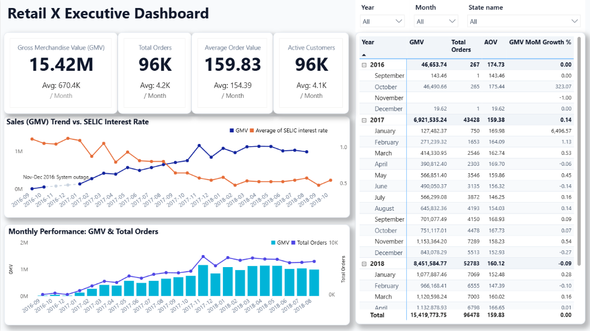
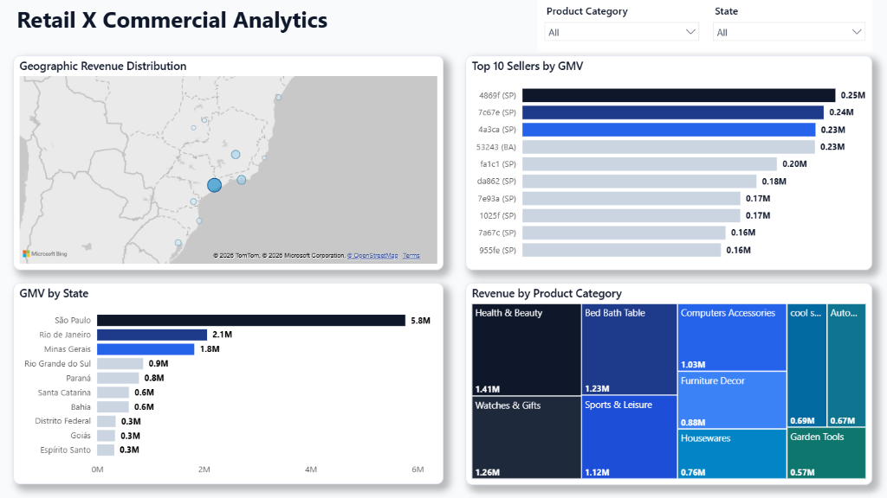
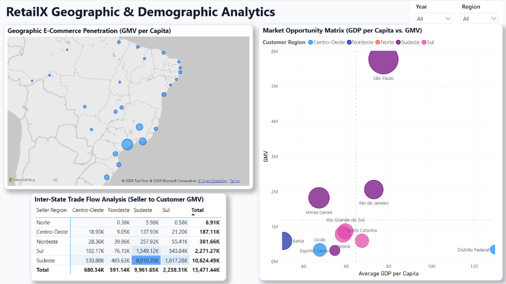
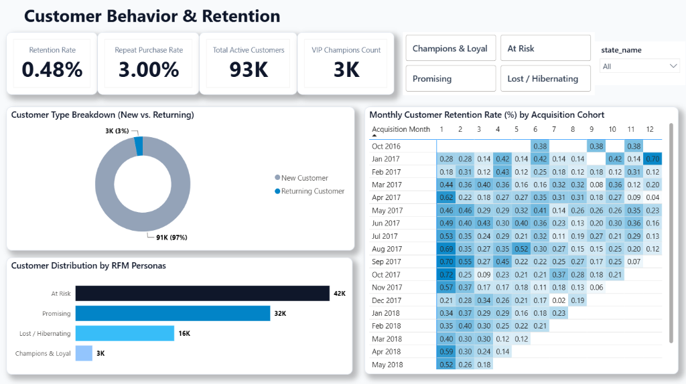
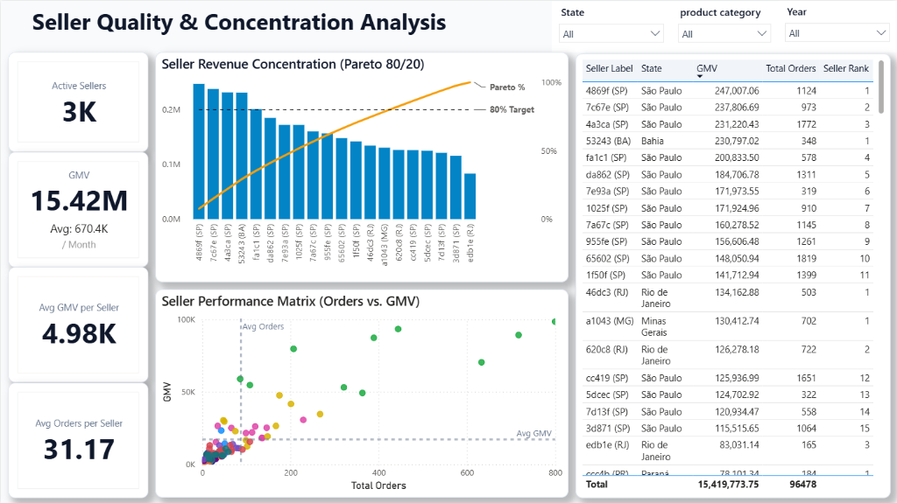
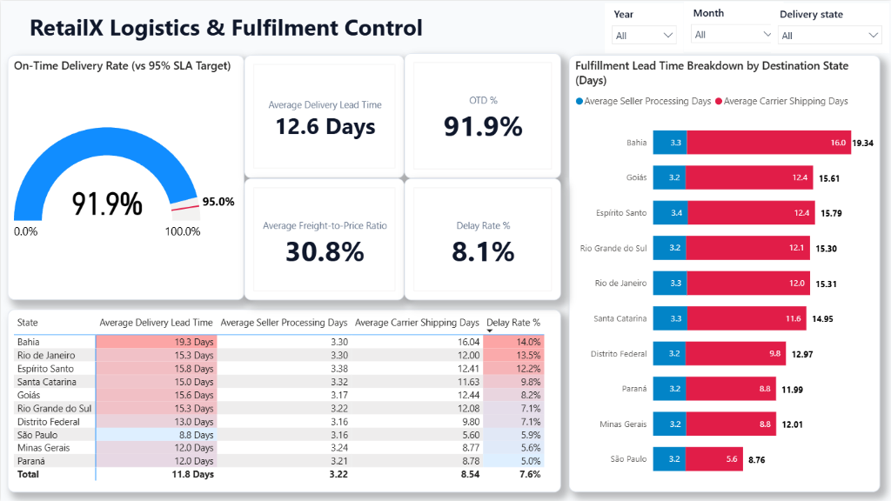

# RetailX Executive Analytics Platform

Welcome to the **RetailX Executive Analytics Platform** portfolio project. This repository contains an end-to-end data analytics and business intelligence solution designed to mimic a real-world analytics environment in a large-scale e-commerce organization.

The platform utilizes the **Brazilian E-Commerce Public Dataset by Olist** and integrates multiple external sources (weather, demographics, macroeconomics, holidays) to build a relational star schema that powers modular Jupyter notebooks and an interactive **Power BI Executive Dashboard**.

---

## Business Overview & Goals

RetailX connects local Brazilian sellers with online buyers. C-level executives face challenges in customer retention, high logistics costs, low cross-selling, and inventory management.

This platform provides a comprehensive 7-page BI blueprint (consolidated into 6 high-impact dashboard pages):
1.  **Executive Overview**: High-level KPI monitoring (GMV, AOV, Orders) combined with macroeconomic conditions (SELIC interest rates).
2.  **Commercial Performance**: Product category treemap, top 10 sellers ranking, event seasonality, and product weight vs. freight analysis.
3.  **Geographic & Demographic Insights**: State-level revenue distribution (GMV per Capita), local GDP per capita alignment, and inter-state trade flows.
4.  **Customer Behavior & Retention**: RFM segmentation, New vs. Returning customer dynamics, and cohort retention heatmaps.
5.  **Seller Quality & Concentration**: Pareto 80/20 distribution of revenue, seller SLA tracking, and handling lead times.
6.  **Operational Logistics Control**: Delivery latency modeling, carrier transit times, OTD % SLA gauges, and weather impact on shipping delays.

---

## 📊 Executive Dashboard Showcase

The interactive BI solution is implemented in Power BI ([`Executive Dashboard.pbix`](Executive%20Dashboard.pbix)). Below are the key dashboard pages and analytical insights:

### 1. Executive Overview

* **Core Business KPIs**: Tracks top-level marketplace health including Gross Merchandise Value (**15.42M BRL**), Total Orders (**96K**), Average Order Value (**159.83 BRL**), and Active Customers (**96K**).
* **Macroeconomic Alignment**: Correlates monthly revenue trends against Brazil's **SELIC benchmark interest rate** to analyze consumer spending sensitivity to monetary policy.
* **Performance Matrix**: Delivers monthly and annual MoM growth rates with multi-dimensional filtering across years, months, and customer states.

---

### 2. Commercial & Product Performance

* **Geographic Revenue Distribution**: Map visualization highlighting regional revenue hubs, led by **São Paulo (5.8M BRL)**, **Rio de Janeiro (2.1M BRL)**, and **Minas Gerais (1.8M BRL)**.
* **Category Share Treemap**: Visualizes product segment contributions, highlighting leading categories: *Health & Beauty* (1.41M BRL), *Watches & Gifts* (1.26M BRL), and *Bed Bath Table* (1.23M BRL).
* **Top Seller Contribution**: Ranks top merchant partners driving marketplace sales volume and revenue.

---

### 3. Geographic & Demographic Analytics

* **Market Opportunity Matrix**: Cross-plots regional **GDP per Capita vs. GMV** to identify untapped high-income regions (e.g., *Distrito Federal*) versus core saturated powerhouses (*São Paulo*).
* **Inter-State Trade Flow Analysis**: Origin-Destination matrix mapping logistical and revenue flow from seller hubs to customer destinations, highlighting the dominance of the **Sudeste** region.
* **E-Commerce Penetration**: Evaluates normalized spend per capita across all Brazilian federal units.

---

### 4. Customer Behavior & Retention (RFM & Cohorts)

* **Retention & Repurchase Dynamics**: Diagnoses marketplace retention challenges (**97% New vs. 3% Returning Customers**, with a **0.48%** overall retention rate).
* **RFM Customer Personas**: Segments the customer base into actionable tiers—*At Risk* (42K), *Promising* (32K), *Lost / Hibernating* (16K), and *Champions & Loyal* (3K).
* **Acquisition Cohort Heatmap**: Tracks monthly retention decay across a 12-month post-acquisition horizon to optimize re-engagement strategies.

---

### 5. Seller Quality & Concentration (Pareto 80/20)

* **Pareto 80/20 Analysis**: Analyzes seller revenue concentration and merchant dependency against the 80% cumulative revenue benchmark.
* **Seller Performance Matrix (Orders vs. GMV)**: Categorizes merchants across order throughput and total sales value to distinguish high-volume merchants from high-ticket specialty sellers.
* **Merchant Quality Ranking**: Provides deep-dive operational visibility into seller location, order fulfillment count, and GMV rankings.

---

### 6. Logistics & Fulfilment Control

* **SLA Performance Gauge**: Tracks the platform's **On-Time Delivery (OTD) rate at 91.9%** against the executive target of **95.0%**, highlighting an overall **Delay Rate of 8.1%**.
* **Lead Time Decomposition**: Breaks down end-to-end delivery cycle (**Avg 12.6 Days**) into **Seller Processing Days (Avg 3.22 Days)** and **Carrier Shipping Days (Avg 8.54 Days)** across all destination states.
* **Geographic Latency Bottlenecks**: Identifies vulnerable delivery corridors such as *Bahia* (19.3 days lead time, 14.0% delay rate) and *Rio de Janeiro* (13.5% delay rate) compared to optimized hubs like *São Paulo* (8.8 days, 5.9% delay rate).
* **Freight Cost Burden**: Monitors the **Freight-to-Price Ratio (30.8%)** to isolate regions where high shipping costs negatively impact cart conversion.

---

## Technology Stack & Architecture

*   **Database**: PostgreSQL (Structured in a Kimball Star Schema)
*   **Business Intelligence**: Power BI Desktop ([`Executive Dashboard.pbix`](file:///c:/Users/White/OneDrive/Desktop/git/olist-ecommerce-analytics/Executive%20Dashboard.pbix) with DAX Measures Catalog)
*   **Data Pipelines & Analytics**: Python (Pandas, NumPy, SQLAlchemy, Scikit-Learn, Statsmodels, Meteostat, Holidays, YFinance, Requests)
*   **Knowledge Base**: Obsidian (Vault located in [`top1_project/`](file:///c:/Users/White/OneDrive/Desktop/git/olist-ecommerce-analytics/top1_project/)) including:
    *   [RetailX Executive BI Platform (TH)](file:///c:/Users/White/OneDrive/Desktop/git/olist-ecommerce-analytics/top1_project/03.%20Business%20Strategy/RetailX%20Executive%20BI%20Platform%20%28TH%29.md) — Business overview and decision-making scenarios.
    *   [Exhaustive 7-Page BI Blueprint](file:///c:/Users/White/OneDrive/Desktop/git/olist-ecommerce-analytics/top1_project/03.%20Business%20Strategy/Exhaustive%207-Page%20BI%20Blueprint.md) — Dashboard specs for all analytics pages.
    *   [Power BI Sales Dashboard Guide (TH)](file:///c:/Users/White/OneDrive/Desktop/git/olist-ecommerce-analytics/top1_project/03.%20Business%20Strategy/Power%20BI%20Sales%20Dashboard%20Guide%20%28TH%29.md) — Step-by-step developer tutorial.

### Data Model & Schema

The platform contains documentation for both the original transactional database and the analytical Kimball Star Schema:
*   **Original Transactional Schema**: Documented in [Source Data Model (Raw)](file:///c:/Users/White/OneDrive/Desktop/git/olist-ecommerce-analytics/top1_project/01.%20Data%20Architecture/Source%20Data%20Model%20%28Raw%29.md) representing Olist's 9 raw source tables.
*   **Kimball Star Schema**: Detailed in [Data Model (Star Schema)](file:///c:/Users/White/OneDrive/Desktop/git/olist-ecommerce-analytics/top1_project/01.%20Data%20Architecture/Data%20Model%20%28Star%20Schema%29.md) connecting transactional records with contextual data tables:
    *   **Fact Table**: [`fact_sales`](file:///c:/Users/White/OneDrive/Desktop/git/olist-ecommerce-analytics/sql/fact_sales.sql) (Sales, prices, freight values, order timestamps)
    *   **Dimension Tables**:
        *   [`dim_customer`](file:///c:/Users/White/OneDrive/Desktop/git/olist-ecommerce-analytics/sql/dim_customer.sql) / [`dim_seller`](file:///c:/Users/White/OneDrive/Desktop/git/olist-ecommerce-analytics/sql/dim_seller.sql): Customer and seller geographic attributes.
        *   [`dim_product`](file:///c:/Users/White/OneDrive/Desktop/git/olist-ecommerce-analytics/sql/dim_product.sql): Product dimensions, weights, and categories.
        *   `dim_date`: Unified calendar with holiday tags and payday flags.
        *   `dim_demographics`: Brazilian state-level population, GDP, and HDI.
        *   `dim_weather`: Daily average temperature and precipitation in key metropolitan regions.
        *   `dim_macroeconomics`: Monthly Selic interest rates and inflation (IPCA).

---

## Project Structure

The repository is organized as follows:

```
olist-ecommerce-analytics/
│
├── .agents/                    # Workspace agent guidelines & rules
│   └── AGENTS.md
│
├── Executive Dashboard.pbix     # Power BI Interactive Executive Dashboard
│
├── sql/                        # SQL scripts for data marts & schema
│   ├── add_key.sql             # Script to define primary and foreign keys for raw tables
│   ├── add_star_schema_keys.sql# Script to define primary and foreign keys for star schema
│   ├── dim_customer.sql        # Dimension table for customers
│   ├── dim_product.sql         # Dimension table for products
│   ├── dim_seller.sql          # Dimension table for sellers
│   ├── fact_sales.sql          # Core fact table for transaction lines
│   ├── fact_sale_star.sql      # Star schema assembly script
│   └── marts/                  # Performance-optimized views and materialized views
│       ├── mv_sales_customer_daily.sql
│       ├── mv_sales_daily.sql
│       ├── mv_sales_geo_daily.sql
│       ├── mv_sales_product_daily.sql
│       ├── mv_sales_seller_daily.sql
│       ├── vw_mart_customer_retention_cohorts.sql
│       └── vw_mart_opetations_logistics.sql
│
├── notebooks/                  # Python data preparation & analysis notebooks
│   ├── demographic.ipynb       # Demographics data processing
│   ├── event_calendar.ipynb    # Holidays and paydays processing
│   ├── external_data.ipynb     # Weather & macroeconomic API pipelines
│   ├── macro_economics.ipynb   # Inflation & SELIC interest rates analysis
│   ├── rfm.ipynb               # RFM customer segmentation analysis
│   ├── top10.ipynb             # Top products & sellers analysis
│   └── 07_weather_impact_analysis.ipynb # Weather impact regression analysis
│
├── scripts/                    # Test & utility scripts
│   └── test_weather.py
│
├── top1_project/               # Obsidian Vault for Executive Documentation
│   ├── 00. Project Overview/   # Project briefs and KPI frameworks
│   ├── 01. Data Architecture/  # Data dictionaries, raw schemas, and star schemas
│   ├── 02. Analysis Modules/   # Deep-dive reports on analytics
│   └── 03. Business Strategy/  # Executive strategic recommendations & BI blueprints
│
├── pass.env                    # PostgreSQL database credentials (git-ignored locally)
└── README.md                   # Project cover page (this file)
```

---

## Setup & Installation

### 1. Database Connection
Create a `pass.env` file in the root directory with your PostgreSQL connection parameters:
```env
DB_TYPE=postgresql
DB_USER=your_username
DB_PASS=your_password
DB_HOST=localhost
DB_PORT=5432
DB_NAME=ecommerce_olist
```

### 2. Install Dependencies
Install Python libraries required for data extraction, manipulation, and analysis:
```bash
pip install pandas numpy sqlalchemy psycopg2 python-dotenv meteostat holidays yfinance requests matplotlib seaborn scikit-learn statsmodels
```

### 3. Data Processing & Analysis
Run the Jupyter notebooks inside the `notebooks/` directory to fetch external data, construct star schema dimensions, and execute statistical analyses.

### 4. Launch Executive Dashboard
Open [`Executive Dashboard.pbix`](file:///c:/Users/White/OneDrive/Desktop/git/olist-ecommerce-analytics/Executive%20Dashboard.pbix) using **Power BI Desktop** to explore the interactive dashboard pages.

